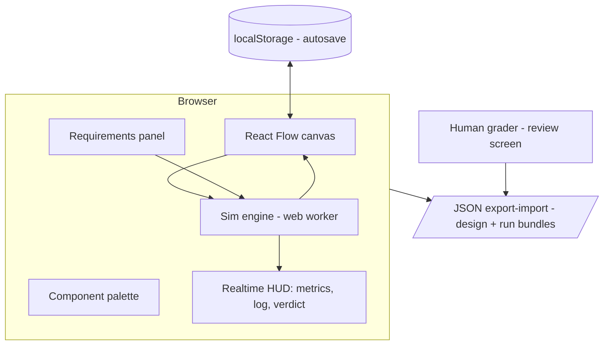

# 01 — Architecture

## Stack (decided)

| Layer | Choice | Why |
|---|---|---|
| Framework | Next.js 16 (App Router) + TypeScript | One codebase, one deployable, API routes included |
| Canvas | React Flow (`@xyflow/react`) | Typed node/edge graph → serializes to JSON → simulatable & gradable. Custom React nodes give full visual control |
| State | Zustand | React Flow's recommended store; simple, no boilerplate |
| Styling | Tailwind CSS | Fast iteration on custom nodes |
| Simulation | Pure TypeScript module + Web Worker | Deterministic, testable, runs client-side at 10 ticks/s with zero backend |
| Persistence | localStorage + JSON file export/import | No accounts, no server state; a design or run is a file you can share (decision 2026-07-12 — DB/auth dropped) |
| Grading | Human + rubric scorecard | Grader imports the exported run file: recorded action timeline + sim replay, scores per phase. AI grading (Claude API) deferred to far-future premium |
| Auth | None | Local-first single-user app; nothing to protect |
| Deploy | Vercel / any Node host | Stateless app — no DB to operate; decide specifics at M5 |

Key principle: **engine-style modularity** — every `src/lib/*` folder is a pure-TS engine with plain-data contracts, no framework imports, no sideways dependencies. The UI is a thin shell wiring engines together. Full rules, extension points, and enforcement: [[05-engines]].

## System diagram



Realtime = worker posts a `SimFrame` every tick; canvas nodes re-render utilization bars/colors, edges animate flow. No websockets needed for single-player; interviewer spectating (post-MVP) adds a broadcast channel.

## Repo layout (`app/`)

```
app/
├── src/
│   ├── app/
│   │   ├── page.tsx            # landing / scenario picker
│   │   ├── design/[id]/page.tsx  # the main canvas screen
│   │   └── review/[runId]/page.tsx  # replay + action timeline + scorecard (loads imported run file)
│   ├── components/
│   │   ├── canvas/
│   │   │   ├── DesignCanvas.tsx       # React Flow wrapper
│   │   │   ├── nodes/ComponentNode.tsx  # generic node: icon, util bar, state color
│   │   │   ├── nodes/GroupNode.tsx      # region/AZ containers
│   │   │   └── edges/FlowEdge.tsx       # animated traffic edge
│   │   ├── palette/Palette.tsx        # drag source, driven by registry
│   │   ├── panels/RequirementsPanel.tsx  # NFR inputs: RPS, p95, consistency, error budget
│   │   ├── panels/ScenarioPanel.tsx      # pick scenario, run/pause, chaos buttons
│   │   ├── hud/MetricsBar.tsx            # p95, error %, served RPS cards
│   │   ├── hud/EventLog.tsx
│   │   └── hud/Verdict.tsx
│   ├── lib/
│   │   ├── registry/
│   │   │   ├── types.ts          # ComponentDef
│   │   │   └── components.ts     # THE data: postgres, redis, kafka, lb, app, cdn, s3...
│   │   ├── simulation/
│   │   │   ├── types.ts          # SimNode, SimFrame, RunResult
│   │   │   ├── engine.ts         # tick(state) => state — pure
│   │   │   ├── node-models.ts    # per-kind capacity/latency/queue math
│   │   │   ├── rules.ts          # ramp/spike/kill/flush/partition appliers
│   │   │   ├── verdict.ts        # NFR pass/fail evaluation
│   │   │   ├── rng.ts            # seeded PRNG (mulberry32)
│   │   │   ├── run.ts            # runSimulation: rules + frames + verdict → RunResult
│   │   │   ├── worker-host.ts    # worker protocol brain (pure, testable)
│   │   │   ├── worker.ts         # worker entry: binds host to self
│   │   │   └── client.ts         # createSimWorker: spawns the worker (browser)
│   │   ├── scenarios/
│   │   │   ├── types.ts          # Scenario schema
│   │   │   └── presets/black-friday.json, celebrity-tweet.json, ...
│   │   ├── grading/
│   │   │   └── rubric.ts         # per-phase rubric with 1–5 anchors (requirements/API/HLD/deep-dive)
│   │   └── actions/
│   │       └── recorder.ts       # records ActionEvents (node added, config changed, note edited...)
│   ├── persistence/
│   │   └── local.ts              # shell util: localStorage autosave + JSON file export/import
│   └── stores/
│       ├── design-store.ts       # zustand: graph, selection
│       ├── scenario-store.ts     # zustand: selected preset + edited NFRs
│       └── sim-store.ts          # zustand: run state, frames, log
├── tests/
│   ├── engine.test.ts            # deterministic scenarios → exact expected frames
│   ├── node-models.test.ts
│   └── verdict.test.ts
├── scripts/
│   └── sim.ts                     # headless CLI: graph + scenario → verdict (npm run sim)
└── examples/                      # demo inputs for the CLI (twitter.json, black-friday.json)
```

## Decisions

- 2026-07-12: React Flow over Excalidraw/tldraw — structured graph is required for simulation and grading.
- 2026-07-12: Simulation client-side, not server-side — free realtime, no infra; results stay local (export files). Revisit if anti-cheat matters.
- 2026-07-12: Next.js **16.2** (current stable), not 15 — spec predated the release; create-next-app ships 16 and bundles migration docs in `node_modules/next/dist/docs/` (see `app/AGENTS.md` warning).
- 2026-07-12: **DB and auth dropped** — local-first app, no server state. localStorage autosaves; designs/runs/scorecards export as JSON files the grader imports on the review screen. Postgres/Drizzle/docker-compose removed from `app/` (removal commit `5f02d71`, code recoverable from `5de2a01`). A DB may return post-MVP (hosting/accounts/AI grading) — all boundary types are JSON-serializable, so the migration stays mechanical; see [[02-data-model]] "If a database returns".
- 2026-07-12: Grading is human-first. The grader "watches" the candidate via the recorded action timeline + sim replay and fills a rubric scorecard. AI grading (Claude API) moved to far-future premium — removes API cost, prompt engineering, and trust questions from MVP.
