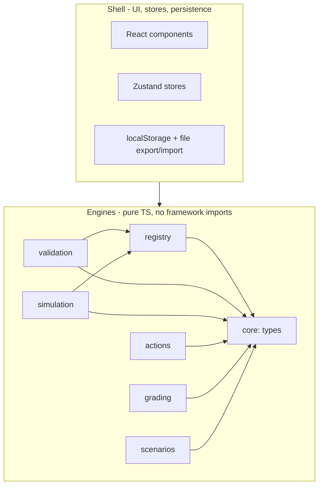

# 05 — Engine architecture & module boundaries

Design principle: the app is a set of small **engines** — pure TypeScript modules that take plain data in and return plain data out — plus a thin UI shell that wires them together. Engines never import each other, React, Next.js, or the database. This is what makes the project simple to reason about, testable, and extensible file-by-file with Claude Code.

## The engines

| Engine | Contract (in → out) | Imports allowed |
|---|---|---|
| `core` | shared types only (DesignGraph, Scenario, SimFrame, ActionEvent, ComponentDef...) | nothing |
| `registry` | — (pure data: ComponentDefs) | core |
| `validation` | DesignGraph → Warning[] | core, registry |
| `simulation` | (graph, scenario, seed) → frames + verdict | core, registry |
| `actions` | store mutation → ActionEvent | core |
| `grading` | — (pure data: rubric) | core |
| `scenarios` | — (pure data: presets + schema guard) | core |

Everything else is **shell**: React components, Zustand stores, persistence (localStorage + file export/import). Shell may import any engine; engines never import shell.

## Rules (enforced, not aspirational)

1. **Public API only.** Each engine exposes everything through its `index.ts`. Deep imports (`simulation/node-models`) are forbidden outside the engine's own folder and its tests.
2. **No sideways imports.** Engine → engine only where the table above allows it (and only via `index.ts`). Need data from another engine? The shell fetches it and passes it in as an argument.
3. **No framework in engines.** `react`, `next`, `zustand`, `drizzle`, `@xyflow` are banned imports inside `src/lib/**`. Engines are plain functions over plain data.
4. **Plain data at boundaries.** Engine inputs/outputs are JSON-serializable — no classes, no functions in payloads. (Free bonus: everything crosses the web-worker boundary and persists to JSONB without adapters.)
5. **Enforced by tooling:** dependency-cruiser config codifies this table; violations fail `npm run lint` and CI. Not a code-review convention — a build error.

## Extension points (how the project grows without surgery)

Each engine grows by **adding a data entry or a map entry**, never by editing a switch statement in another module:

| To add... | Touch only |
|---|---|
| New component (e.g. websocket gateway) | `registry/components.ts` — one ComponentDef. Palette, canvas node, and simulation pick it up automatically |
| New node behavior (kind needs custom math) | `simulation/node-models.ts` — register in the `modelByKind` map |
| New stress rule (e.g. `disk-full`) | `simulation/rules.ts` — register in the `ruleAppliers` map + add to the StressRule union |
| New verdict check | `simulation/verdict.ts` — push a `Criterion` into the criteria list |
| New validation warning | `validation/` — push a `Check` into the checks list |
| New scenario | `scenarios/presets/*.json` — pure data, no code |
| New rubric dimension | `grading/rubric.ts` — pure data |
| New recorded action | `actions/` — extend ActionKind union + one emitter |

Pattern everywhere: **registry map + plain data**, not inheritance, not DI frameworks, not event buses. If a feature can't be added through one of these points, that's the signal to design a new extension point — log it in Decisions.

## Dependency budget

Runtime dependencies are a liability; the target list is short: `next`, `react`, `@xyflow/react`, `zustand`, `lucide-react` (shell-only, see 2026-07-12 decision). Dev: `typescript`, `vitest`, `eslint`+`prettier`, `dependency-cruiser`, `tailwindcss`, `tsx` (sim CLI runner). (`drizzle-orm`/`postgres`/`next-auth` dropped with the DB 2026-07-12 — they return only if a DB does.) Adding any other runtime dependency requires a Decisions entry answering: what does it save, what does it cost, could 30 lines of our own code do it?

## Decisions

- 2026-07-12: dependency-cruiser over eslint-plugin-boundaries — standalone graph validation, generates a module-graph SVG for the vault as a side effect.
- 2026-07-12 (T-1.2 planning): `lucide-react` added to the dependency budget. What it saves: hand-maintaining SVGs for every registry icon (`ComponentDef.icon` is a lucide name by design). Cost: one tree-shakeable dep — shell keeps a named-import icon map (`src/components/icons.tsx`) so bundles stay small; unknown names fall back to a generic Box icon, preserving "add registry entry = zero required code". Could 30 lines do it: only by inlining SVGs, which recreates the library badly. Engines still never import it — added to the depcruise ban list.
- 2026-07-14 (T-2.7 planning): `tsx` added to the dev-dependency list. What it saves: running `scripts/sim.ts` (the sim CLI) under Node with the `@/*` tsconfig alias every engine file uses internally — Node 24's native type-stripping cannot resolve path aliases. Cost: one dev-only dep, zero runtime footprint. Could 30 lines do it: only as a custom module-resolution loader — exactly the fiddly code a maintained runner replaces. Engines never import it; depcruise now also scans `scripts/` (the CLI is shell: engine imports via index.ts only).
